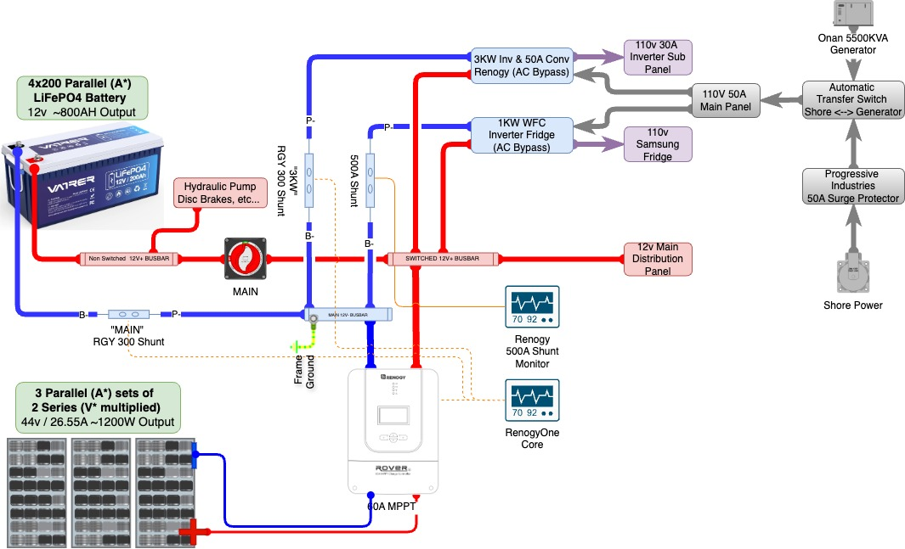

# Renogy Build 



## Objective: [Renogy System Diagram](sysdesign/Rogue1-ElectDist-Simple.pdf)
* Monitor Renogy Solar System and store data in InfluxDB and visualize in Grafana

* 12v Electrical System Components:
	* 800ah - 4 x 200ah 12v Vatrer LifePO4 Batteries
	* 1200W Solar - 6 x 200w Renogy Solar Panels (3 parallel sets of 2 panels in series)
	* "Solar/MPPT" - Renogy Rover 60a MPPT Charge Controller
	* "Main" - Renogy 300a Smart Shunt on negative battery terminal
	* "Inv/Conv" - Renogy 300a Smart Shunt on negative inverter terminal
	* Renogy 3kw Inverter/Converter (A/C pass through)
* Monitoring Components:
	* Renogy One Core "Head End" connected to 2 Smart Shunts and MPPT Controller
	* Renogy API Access via account/API Key 
	* Raspberry Pi4
		* Python Script (as systemd service) to pull data from Renogy API, transform and send to InfluxDB 
		* InfluxDB2
		* Grafana for visualization / dashboarding 


## RapsberryPi Dependencies 
```bash
sudo apt update
sudo apt install -y git python3 python3-pip
pip3 install requests python-dotenv influxdb-client
```

## Install InfluxDB 
* Listening on http://localhost:8086
```bash
sudo wget -qO- https://repos.influxdata.com/influxdata-archive_compat.key | sudo gpg --dearmor -o /usr/share/keyrings/influxdata-archive.gpg
sudo echo "deb [signed-by=/usr/share/keyrings/influxdata-archive.gpg] https://repos.influxdata.com/debian stable main" | sudo tee /etc/apt/sources.list.d/influxdb.list
sudo apt update
sudo apt install -y influxdb2
sudo systemctl start influxdb
sudo systemctl enable influxdb
```

* configure influxdb
```bash
influx setup
```
* You will be prompted to provide:
	* Username: Admin username
	* Password: Admin password
	* Organization Name: e.g., power_org
	* Bucket Name: e.g., power_monitoring
	* Retention Period: in Hours, Use 0 for infinite retention
	* Setup a user token: Use the generated token to authenticate requests to InfluxDB

* Create Token 
```bash
influx auth create \
  --org power_org \
  --write-buckets \
  --read-buckets
```
* use the org, token and bucket name in the .env file


## Install Grafana 
* Listening on http://localhost:3000
```bash 
wget -q -O - https://packages.grafana.com/gpg.key | sudo apt-key add -
echo "deb https://packages.grafana.com/oss/deb stable main" | sudo tee -a /etc/apt/sources.list.d/grafana.list
sudo apt update
sudo apt install grafana
sudo systemctl enable grafana-server
sudo systemctl start grafana-server
```

## Setup external environment file (that is not cloned)
```bash
sudo mkdir -p /usr/local/etc/renogy
sudo nano /usr/local/etc/renogy/renogy.env
# add the lines shown in .env.example file in the repo
sudo chmod 600 /usr/local/etc/renogy/renogy.env
```


## Implement Python Query 
git clone the repository 
```bash
cd /usr/local/src
git clone https://github.com/absgrafx/nomad-oracle.git
cd nomad-oracle/renogy
python3 /usr/local/src/nomad-oracle/renogy/renogyquery.py
```

## Create the query service 
* Create the service File 
```bash
sudo nano /etc/systemd/system/renogyquery.service
```
* Add the following content & Save the file 
```bash
[Unit]
Description=Renogy Query Script
After=network.target

[Service]
WorkingDirectory=/usr/local/src/nomad-oracle/renogy
ExecStart=/usr/bin/python3 /usr/local/src/nomad-oracle/renogy/renogyquery.py
Restart=always
EnvironmentFile=/usr/local/etc/renogy/renogy.env

[Install]
WantedBy=multi-user.target
```
* Enable and start the service 
```bash
sudo systemctl daemon-reload
sudo systemctl enable renogyquery
sudo systemctl start renogyquery
sudo systemctl status renogyquery
```

## Setup Grafana Dashboard 
* Configure InfluxDB as a Data Source:
	* In Grafana, go to “Configuration” > “Data Sources” > “Add Data Source” and select InfluxDB.
	* Configure the connection using your InfluxDB details.
	* Create Panels:
	* Add visualizations for system voltage, watts, amperage, battery temperature, and SOC.
	* Use queries like from(bucket: "power_monitoring") |> range(start: -5m) to fetch recent data.
* Use the sample file `grafana_renogy_dashboard.json` to import the dashboard 
	* you will have to modify data source and bucket name to match your setup

## **Optional** -  Securing the Renogy System Service
* Add Service user "renogy" and change permissions for env file and source code
```bash
sudo useradd -r -s /bin/false renogy
sudo chown renogy:renogy /usr/local/etc/renogy/renogy.env
sudo chmod 600 /usr/local/etc/renogy/renogy.env
sudo chown -R renogy:renogy /usr/local/src/nomad-oracle/renogy
sudo chown -R renogy:renogy /usr/local/src/nomad-oracle/renogy
```
* Modify the service file to add User and Group
```bash
sudo nano /etc/systemd/system/renogyquery.service
```
* Add the following content to the [Service] section & Save the file 
```bash
User=renogy
Group=renogy
```
* Enable and start the service 
```bash
sudo systemctl daemon-reload
sudo systemctl restart renogyquery.service
```
## **Optional** - Compile the Python script to a binary
* Install PyInstaller (output is in the /dist folder)
```bash	
pip3 install pyinstaller
pyinstaller --onefile renogyquery.py
```
* Modify the service file to point to the binary
```bash	
sudo nano /etc/systemd/system/renogyquery.service
```

## TO DO: 
1. Move to Cloud/AWS (ECS, NativeSaaS, EFS, Etc...)
1. Fix Python script to ensure all fields are mapped to proper type (watts=power, amps, volts, etc...)
1. What transformations should be made at the ingestion level to make things easier? 
	* store Watts, Volts and Amps at the time of ingestion? 
	* store daily totals for Solar Production and Consumption (separate Influx Bucket)
1. Add more error handling and logging of python code 
1. Add function to pull daily data for Solar Production and/or total Consumption (What long term, daily details are needed)? 
1. Grafana Cloud 
1. Peplink data from Device and/or InControl to New Dashboard 
1. Can InfluxDB2 be used as Home Assistant data source (instead of Grafana)? 

